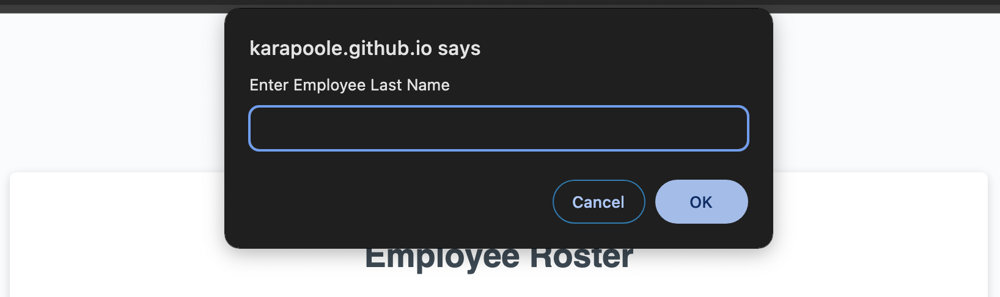
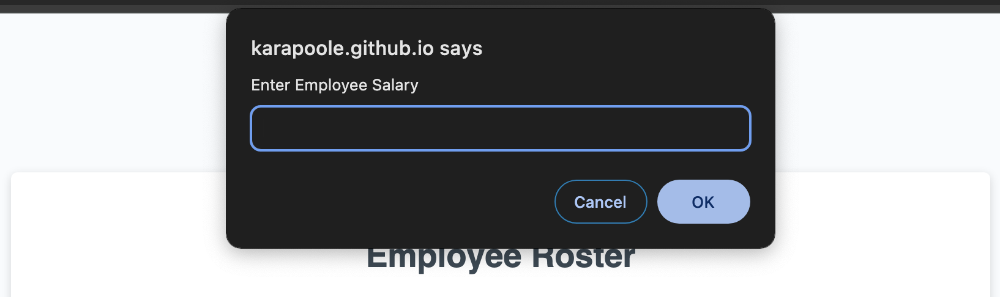
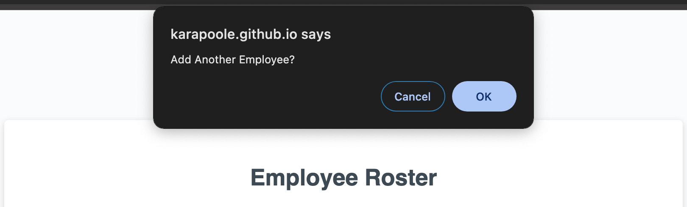
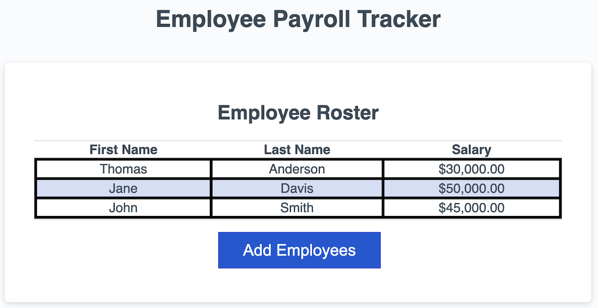
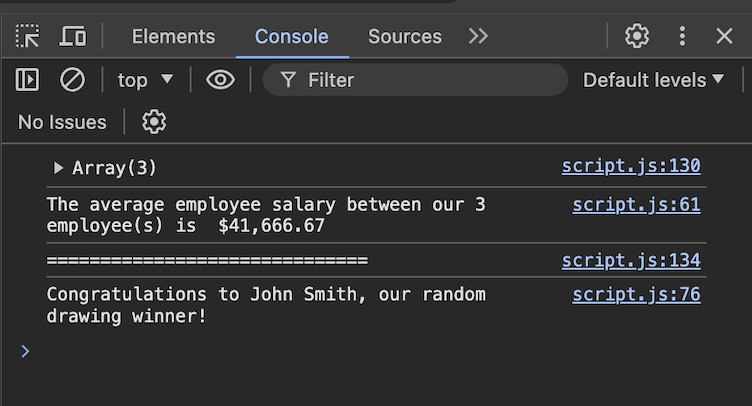
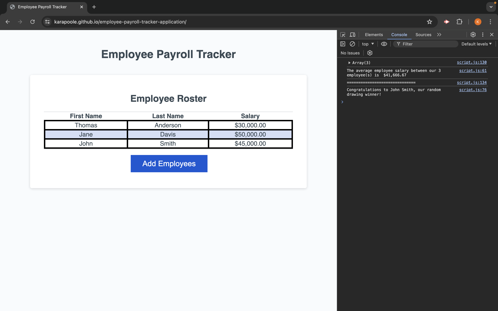

# <Empoyee-Payroll-Tracker-Application>

## Description

The purpose of this project was to modify starter code to create an application that tracks employee payroll data in a browser. Upon clicking the “add employee” button in the browser, the user is prompted to input employee first name, last name, and salary. To accomplish this, a series of prompt functions inside a while loop were added to the starter code.

The user is then asked if they would like to add information for another employee through a confirm function. If the user is done entering employee information, they can choose “cancel” and their data is displayed via the browser and console.

Employees names and salary are listed alphabetically in a table through the browser. Employee salary average is calculated though a for loop inside of a function and logged to the console. Finally, the built in Math object is used with the Math.random() method to select a random employee as a drawing winner and is displayed via console log.

## Table of Contents

- [Usage](#usage)
- [Application](#application)
- [License](#license)

## Usage

### First Name Prompt

### Last Name Prompt

### Salary Prompt

### Confirm Prompt

### Table in Browser

### Console Log

## Application

#### Deployed Applciaiton URL:

https://karapoole.github.io/employee-payroll-tracker-application/

#### Screenshot:

## License

Please refer to license in repo.
